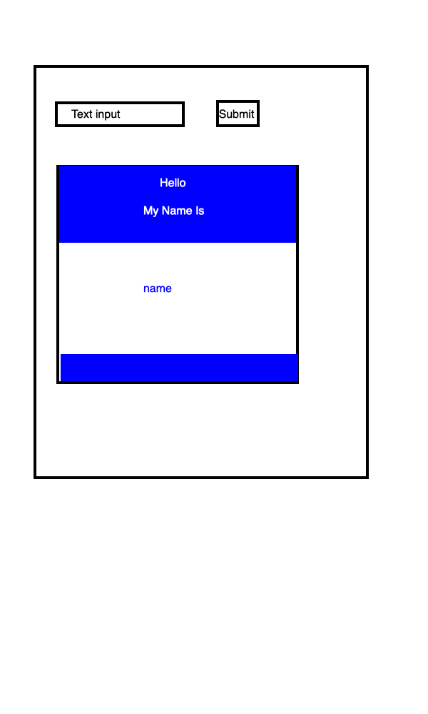

# Name Tag Project

## HTML Elements

-   input
-   button
-   content container for the nametag
    -   div for the top
    -   div for the bottom
-   h1 for "Hello"
-   h3 "my name is"
-   h2 for the name

## Events

-   listen for button click
-   get value from the text input
-   target and save the text input
-   change the text content of the name and replace it with the saved text input
-   clear out the text input

